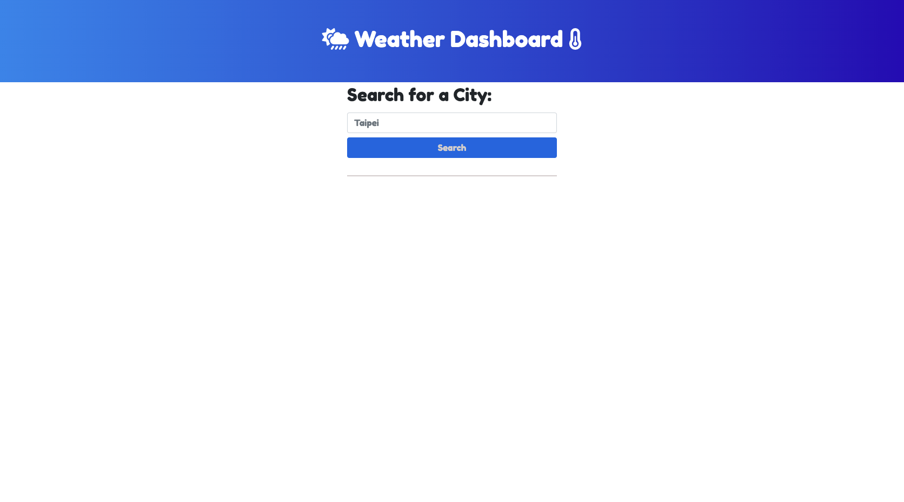
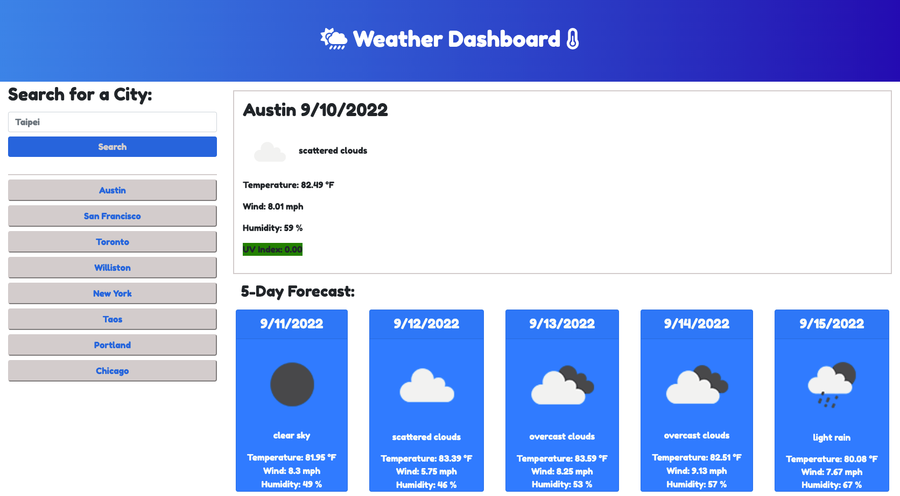

# 06WeatherDashboard

Create a weather app that calls an API for current weather and 5 day forecast to display for cities entered. The app creates buttons for the cities entered so the user can go back and recall a previous city without typing the city in again. The UV Index display changes color depending on the severity of the UV exposure. 

## Description
*On page load the user is presented with a blank form to enter a city

*Upon hitting the search button, the current weather is displayed with the 5 day forecast presented underneath. The current weather includes the city name, date, icon of forecast, description of weather, temperature, wind, humidity, and UV Index. The 5 day forecast includes date, icon, description, temperature, wind, and humidity.

*The search bar moves to the left side of the screen with a button for the city previously entered. a new button will be created for each city entered.

*The user can click any of the city buttons created to recall the weather and 5 day forecast. 

*The UV data will change color depending on the severity of the forecast. 

## Mock-up
The images below shows the webpage created

## Location
https://twangerwang.github.io/06WeatherDashboard/

## Credits
icons from FontAwesome, fonts from Google

## License
MIT License

Copyright (c) 2022 Teddy Wang

Permission is hereby granted, free of charge, to any person obtaining a copy
of this software and associated documentation files (the "Software"), to deal
in the Software without restriction, including without limitation the rights
to use, copy, modify, merge, publish, distribute, sublicense, and/or sell
copies of the Software, and to permit persons to whom the Software is
furnished to do so, subject to the following conditions:

The above copyright notice and this permission notice shall be included in all
copies or substantial portions of the Software.

THE SOFTWARE IS PROVIDED "AS IS", WITHOUT WARRANTY OF ANY KIND, EXPRESS OR
IMPLIED, INCLUDING BUT NOT LIMITED TO THE WARRANTIES OF MERCHANTABILITY,
FITNESS FOR A PARTICULAR PURPOSE AND NONINFRINGEMENT. IN NO EVENT SHALL THE
AUTHORS OR COPYRIGHT HOLDERS BE LIABLE FOR ANY CLAIM, DAMAGES OR OTHER
LIABILITY, WHETHER IN AN ACTION OF CONTRACT, TORT OR OTHERWISE, ARISING FROM,
OUT OF OR IN CONNECTION WITH THE SOFTWARE OR THE USE OR OTHER DEALINGS IN THE
SOFTWARE.